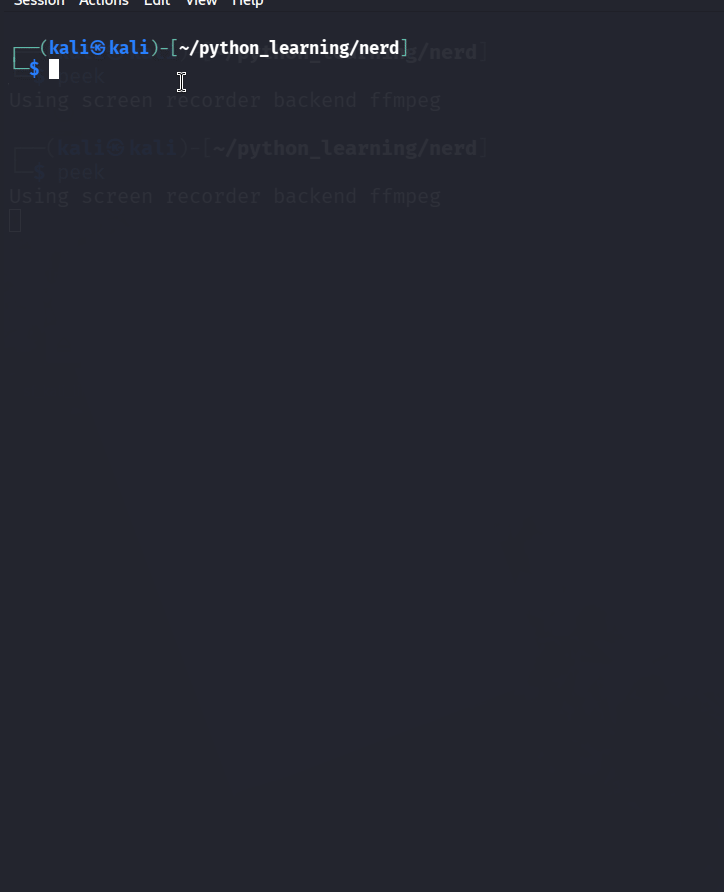

# NERD


# About

Authentication still relies heavily on usernames and passwords. While modern security mechanisms such as Multi-Factor Authentication (MFA) have become increasingly common, passwords remain the first line of defense for millions of systems worldwide.

One of the biggest challenges in password security is **human behavior**. People rarely create completely random passwords. Instead, they often combine memorable information such as their names, birthdays, pets, favorite movies, locations, lucky numbers, or other personal details. These predictable habits make password guessing attacks more effective when performed against weak authentication systems.

**NERD** was created to study these real-world password creation patterns and generate realistic password candidates for **authorized penetration testing, password auditing, cybersecurity research, and educational purposes**.


---

# 📋 Requirements

* Python **3.8** or later

---

# 🚀 Quick Start

Clone the repository:

```bash
git clone https://github.com/mba-official/nerd
```

Move into the project directory:

```bash
cd NERD
```

Run the tool:

```bash
python nerd.py
```


---

# 🎬 Demo



---

# 📁 Output

NERD automatically creates three prioritized password lists:

```text
nerd_output/
_high.txt
_medium.txt
_low.txt
```

This allows testers to begin with the highest-probability passwords before moving to broader wordlists.


---

# ⚠️ Disclaimer

NERD is developed **strictly for ethical and authorized use**.

This project is intended for:

* Authorized Penetration Testing
* Password Security Audits
* Cybersecurity Research
* Educational Purposes
* Capture The Flag (CTF) Environments

The author does **not** support or encourage unauthorized access, malicious activities, or illegal use of this software.

Users are solely responsible for ensuring that they have proper authorization before using NERD against any target system.


---

# 📜 License

This project is released under the **MIT License**.

You are free to use, modify, and distribute this software in accordance with the terms of the license.

See the **[LICENSE](LICENSE)** file for complete license information.

